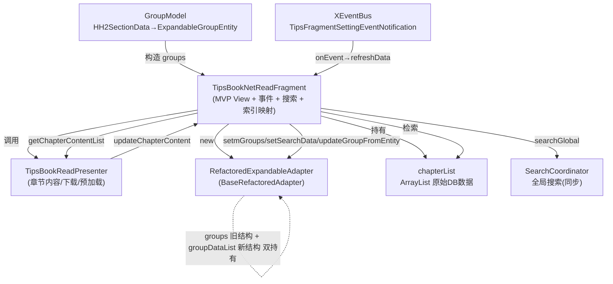

# TipsBookNetReadFragment 与适配器 设计分析（未实现方案）

> **本文档定位**：未实现的设计方案，用于项目开发讨论。**不含已完成修复的细节**。
> 已处理的修复（D1 + D2，状态见 `tips-book-net-read-fixes-done.md`）单独记录，本文档只在「状态总览」和对应条目处给一行指针。
> 每条缺陷均标注**明确状态**，杜绝「✅ 已修复 / 已落地」这类模糊且可能误导的说法：
> - **【已提交】**：代码已入仓（有 commit）。
> - **【代码已写-待提交】**：代码已写进工作区，但尚未 `commit`（HEAD 里没有）。
> - **【未实现】**：仅有设计/方案，零代码改动。
> - **【阻塞-需决策】**：核查发现前提不成立，需用户决策后才能实施。
> - **【部分成立】**：原描述需拆分，一半不成立、一半仍成立。
> - **【范围已厘清】**：经核实确认无需改代码，是分析结论。

---

## 0. 修复状态总览

| 条目 | 状态 | 落点 / 说明 |
| --- | --- | --- |
| **D1** | 【已提交】（`dfca6da`） | 见 `tips-book-net-read-fixes-done.md` |
| **D2** | 【代码已写-待提交】 | 见 `tips-book-net-read-fixes-done.md`；HEAD 中尚未包含 |
| **D2.1** | 【代码已写-待提交】 | §3；`updateDownloadStatus` 已加搜索态守卫 |
| **D3** | 【代码已写-待提交】 | §3；搜索统一走 `Presenter.search()`，注释死块已删 |
| **D4** | 【阻塞-需决策】 | §3；两表均无 `orderBy`，位置索引不可靠，方案待定 |
| **D4.1** | 【代码已写-待提交】 | §3；`currentIndex` / `findChapterIndexByTitle` / 搜索态死块已删 |
| **D5** | 【范围已厘清】（无需改代码） | §3 |
| **D6** | 【代码已写-待提交】 | §3（已订正误诊）；死路径清理已随 D3 一并实施 |
| **D7** | 【代码已写-待提交】 | §3（已订正表述）；EventBus 改 `onStart`/`onStop`，并加在途序号 |
| **D8** | 【代码已写-待提交】 | §3（已订正误诊）；检索已移出主线程，并有进行中提示 |
| **D9** | 【部分成立-见订正】 | §3；增量更新那半不成立，全量重建那半仍存在 |

> 状态口径：**【已提交】**=已入commit；**【代码已写-待提交】**=改在工作区未 commit；**【未实现】**=零代码；**【阻塞-需决策】**=前提不成立待用户决策；**【部分成立】**=原描述需拆分。

---

## 1. 当前架构速写



**要点**：Fragment 既是 MVP 的 View，又兼任「索引映射器 / 搜索执行器 / EventBus 订阅者 / 内存裁剪者」。
Adapter 内部同时持有 `groups`（旧 `ExpandableGroupEntity`）和 `groupDataList`（新 `GroupData`）两套数据源，需手动保持同步。

---

## 2. 适配器设计评估

### 2.1 做得好的部分

- **状态外置**：`ExpandStateManager` 单独管理展开态，避免散落状态位。
- **绑定分层**：`BinderFactory` / `ViewHolderFactory` / `ReadMode*Handler` 拆分了「数据→视图」与「事件委托」，比原生 `onBindXXX` 全堆在一起清晰。
- **公共能力上提**：`BaseRefactoredAdapter` 收敛了展开/收起、空指针保护、公共布局，子类只关心差异。
- **暴露的刷新粒度合理**：`notifyGroupChanged` / `notifyChildrenInserted` 等细粒度通知接口存在。

### 2.2 系统性缺陷（根因：双数据源 + 兼容层只维护了一半）

适配器处于「半重构」状态：干净的新模型（`GroupData`/`ItemData`）与遗留兼容层（`ExpandableGroupEntity groups`）共存，但**只有部分写入路径同步两者**，导致索引/数据随时可能错位。

| 写入入口 | `groups` 是否同步 | `groupDataList` 是否同步 | 备注 |
| --- | --- | --- | --- |
| `setmGroups / setGroups` | 同步 | 同步（转换） | 旧路径 |
| `setGroupDataList` | 未同步 | 同步 | 新路径，**全仓无调用方（死 API）** |
| `setSearchData` | 同步（**D2 待提交**：仅工作区代码，未 commit） | 同步 | 搜索路径；**HEAD 中 `groups` 仍停留在全量章节、与 `groupDataList` 分离** |
| `updateGroupData` | 未同步 | 同步 | 新路径，**全仓无调用方（死 API）** |
| `updateGroupFromEntity` | 同步（若非 null） | 同步 | 新路径，依赖 `groups` 非 null |

**结论**：在 HEAD（已提交状态）下，`setGroupDataList` / `updateGroupData` 两处入口仍令 `groups` 与 `groupDataList` 失同步，且这两处全仓无调用方（死 API），不会实际触发；真正活跃的路径是 `setSearchData`——其 D2 修复代码**已写但尚未提交**，故 HEAD 里活跃双源风险未被消除，提交后才会闭合（详见 `tips-book-net-read-fixes-done.md`）。

---

### 2.3 已处理项：D1 / D2（详细见 `tips-book-net-read-fixes-done.md`）

- **D1【已提交】**（`dfca6da`）：清理死代码 + `isSearchActive()` 搜索态守卫。根因、修复代码、验证均在 done 文档。
- **D2【代码已写-待提交】**：`updateChapterContent` 搜索态守卫 + `setSearchData` 同步 `groups` 镜像。代码已写入工作区（`RefactoredExpandableAdapter.java` 的 `this.groups = mirrorGroups;`、`TipsBookNetReadFragment.updateChapterContent` 守卫），**尚未 commit**，HEAD 中无此修复。
- **本轮（早期）清理的死代码**：适配器 `setSearch/getSearch` 空桩、5 处 `adapter.setSearch(...)` 调用、`onTrimMemory` 空分支、`GroupModel` 注释、`TipsBookNetReadFragment` 空 Javadoc——随 D1 一并提交于 `dfca6da`。

> 注：`RefactoredExpandableAdapter.updateGroupData / setGroupDataList` 虽无调用方，但作为「新结构」API 暂保留，待 §4.1 数据源统一时一并接线或删除，不在本轮处理。

---

## 3. 缺陷清单（带证据，状态明确）

### P0 — 正确性 bug

**D1. 搜索态判断走死桩，长按「重新下载」在搜索模式下索引错乱 ——【已提交】（`dfca6da`）**

- 根因与修复：见 `tips-book-net-read-fixes-done.md` §D1。
- 状态说明：代码已入仓，HEAD 中 `TipsBookNetReadFragment.isSearchActive()` 已存在（约 :297/:348/:710），适配器死桩已删除。

**D2. `setSearchData` 后 `groups` 与 `groupDataList` 分离，下载回调污染搜索结果 ——【代码已写-待提交】**

- 根因与修复代码：见 `tips-book-net-read-fixes-done.md` §D2。
- 状态说明：**代码写在工作区、未 commit**。HEAD 的 `RefactoredExpandableAdapter.setSearchData` 仍只写 `groupDataList`，`groups` 停留在全量章节；`updateChapterContent` 入口也尚未有 `isSearchActive()` 守卫。**提交前此缺陷在代码层面仍是「未修复」状态**。
- **D2.1【代码已写-待提交】**：`updateDownloadStatus` 已加搜索态守卫（`TipsBookNetReadFragment.updateDownloadStatus` 入口 `if (isSearchActive()) return;`）。此前它不可达（调用方在搜索态已被 `onHeaderClick`/`onHeaderLongClick` 的 `return` 拦死），加守卫是为「后续放开搜索态下载」预留正确性，属防御性收口。

### P1 — 设计 / 一致性

**D3. 两套搜索代码路径并存且互相矛盾 ——【代码已写-待提交】**

- 路径 A（Fragment 侧，同步）：`performGlobalSearch`（约 :725）→ `searchCoordinator.searchGlobal(keyword)` 直接拿结果 → `adapter.setSearchData(...)`。
- 路径 B（MVP 侧，异步）：Contract `showSearchResults`（约 :46 声明，Fragment 约 :792 实现）→ `adapter.setmGroups(...)`（旧路径）。
- Fragment 实际只走 A。`presenter.search()` 与 `showSearchResults` 是否死代码见 D6。
- 两条路分别走「新结构」和「旧结构」，是 D2 错位的直接来源。
- **实施结果**：两条路已收敛为一条 —— `Presenter.search()` 成为唯一入口（后台线程执行），回调 `showSearchResults`；Contract 回调签名从 `List<ExpandableGroupEntity>` 改为 `(List<GroupData>, List<List<ItemData>>, int)`，**与适配器绑定的 `groupDataList` 同构**；Fragment 侧的 `searchCoordinator` 字段与直调已删除。

**D4. 索引语义在搜索/非搜索间漂移 ——【阻塞-需决策】**

- 原方案假设「给 `GroupData` 加 `chapterIndex` 即可」，但核查发现**前提不成立**：非搜索列表来自 `Chapter` 表、搜索列表来自 `BookChapter` 表，是两表两套记录；两处 `find(BookId.eq(...))` **均无显式 `orderBy`**（全仓 `orderBy` 零命中），返回顺序不保证一致 → 「搜索第 n项 = 列表第 n 章」不成立。
- 照原方案实施只是把标题匹配换成位置匹配，**错误依旧**。可选方案见 `tips-book-net-read-tickets.md` 的「发现 1」。
- 原`findChapterIndexByTitle` 标题 O(n) 回查已随 D4.1 删除，故 header点击/长按在搜索态已统一 `return`，不再使用错位索引。
- **唯一未收敛的暴露面**：子项长按走 `ReadModeLongClickHandler.onChildLongClick` →「跳转到本章内容」/「重新下本章节」直接使用 `groupPosition`，不经 Fragment 的搜索态守卫，搜索态下仍会命中错章。修复取决于上述方案决策。

**D4.1. 死状态与搜索态死分支（D4 的延伸发现）——【代码已写-待提交】**

- `currentIndex`（约 :90 声明、:323 赋值）**全仓从未被读取**——是纯死状态，「语义漂移」因无人读而无实际影响。
- `onHeaderClick` 搜索态映射块（约 :296-323）反查 `realIndex` 后只写进上面的死变量，随即 `return`——搜索态下该块**无任何可观察效果**，属死代码，可整体删除（与 D1/D2「搜索态只展开不下载」意图一致）。

**D5. 适配器内 `SearchStateManager` 未真正使用 ——【范围已厘清】**

- `BaseRefactoredAdapter` 构造了 `searchStateManager`，`cleanup()` 里只 `reset()` 一次；`RefactoredExpandableAdapter` 全程从未调用其 `enterSearchMode/isSearchMode`。
- **订正**：它并非全局死代码——`RefactoredSearchAdapter`（书内搜索页）在 `enterSearchMode(keyword)` 真正记录搜索态。因此**不能从基类删除**；本适配器只是没用它。
- 结论：搜索态在阅读页路径上确实未走它（与 D1 死桩互为佐证），治理方式应是「阅读页自己维护 `searchText` 单一真相」（已随 D1 修复落地），而非删除共享管理器。**无需改代码**。

### P2 — 生命周期 / 资源

**D6. 双搜索路径与未接线 ——【代码已写-待提交】（已订正误诊）**

- `TipsBookReadContract` 声明 `showSearchResults`（约 :46）与 `search(String)`（约 :201）。**经核实（不轻信注释）**：`TipsBookReadPresenter` 中存在两个 `search()`，真正生效的是约 :627 的**空实现桩**（注释「已弃用，使用 SearchCoordinator」）；另一个调用 `view.showSearchResults` 的 `search()`（约 :575）**整体位于 `/* … */` 注释块内（约 :528-623），并未编译生效**。
- 因此 `showSearchResults`（Fragment 约 :792）是死代码的**真因 = 唯一调用方被注释掉**，而非「两个 search 并存、一个有效」。阅读页 `TipsBookNetReadFragment` 从未调用 `presenter.search()`，而是直接走 `performGlobalSearch` → `SearchCoordinator` → `adapter.setSearchData`（路径 A）。
- 建议：让阅读页改走 `presenter.search()` 统一入口，或删掉 `showSearchResults`/弃用 `search()` 以消歧义。

**D7. XEventBus 注册/注销不对称，存在重入与竞态 ——【代码已写-待提交】（已订正表述）**

- 注册在 `initView()`（约 :193），注销只在 `onDestroy()`（约 :644）；`onDestroyView` 未注销。
- **订正**：标准 Fragment 配置变更会销毁实例并走 `onDestroy` 注销，故「实例存活残留」在默认行为下不成立；真正成立的问题是 **`onDestroyView` 未注销**，以及**真实风险 = 并发异步加载无取消/去重**：`onEvent`（约 :270）每次都 `refreshData()` → `bookInitData()` 异步重新从 DB 拉 `chapterList`，连发事件会多趟覆盖 `chapterList`，无取消机制。

**D8. 搜索在主线程同步执行 ——【代码已写-待提交】（已订正误诊）**

- **订正**：原「未在销毁时清理会泄漏」的判断不成立——`SearchCoordinator` 不持有任何线程/回调（仅存 `bookId` 字符串），无泄漏。
- **真实问题（性能）**：`performGlobalSearch`（约 :725）在**主线程同步调用** `searchGlobal`（整本书 DB 读 + 过滤 + 高亮），章节多的书会阻塞主线程掉帧 / 潜在 ANR。修复方向见 §4.8。

**D9. `getExpandableGroups` 每次重建整份实体列表 ——【部分成立-已订正】**

- 原描述「`reListAdapter` 与 `updateChapterContent` 每次都全量重建」**只对一半**：
  - `updateChapterContent`（约 :420）**不成立** —— 它只对**单个** `groupPosition` 构造一个 `ExpandableGroupEntity` 并走 `updateGroupFromEntity`，已是增量更新。
  - `reListAdapter(true, ...)` **成立** —— 它走 `GroupModel.getExpandableGroups` 全量重建；除初始化与清空搜索外，`refreshData()`（由 EventBus 设置变更事件触发）也会调用它，此时同样全量重建。
- 结论：D9 降级为**低优先级性能项**（非 bug），且不适用「改增量 `updateGroupData`」的方案 —— 该 API 目前全仓无调用方（死API，见 §2.2）。真要做，应先给 `refreshData` 加「数据未变则跳过重建」的判据。

---

## 4. 优化方案（目标架构）

### 4.1 根因治理：让适配器只持有一份数据源

**原则**：废弃 `groups` 旧兼容层，适配器以 `groupDataList`（`GroupData`）为唯一真相；`ExpandableGroupEntity` 仅在「需要从旧模型构造」的边界一次性转换为 `GroupData`，之后不再回写。

```java
// BaseRefactoredAdapter 改动示意
protected final List<GroupData> groupDataList;          // 唯一数据源
// 删除 protected ArrayList<ExpandableGroupEntity> groups;
// 删除 getmGroups()/setmGroups()（旧兼容层）
// 统一入口：
public void submitList(@NonNull List<GroupData> list) { /* 替换 + reset 展开态 + notify */ }
```

Fragment 侧相应改为只操作 `GroupData`：

- `reListAdapter` → `adapter.submitList(GroupModel.toGroupData(contentList, isExpand))`
- `updateChapterContent` → 直接对 `groupDataList.get(pos)` 做字段更新（保留展开态），不再经 `ExpandableGroupEntity` 中转。
- 搜索：`setSearchData` 与 `submitList` 走同一 setter，消除 D2 的分离。

> **状态说明**：D2 的「双保险」修复（搜索态守卫 + `groups` 镜像）**代码已写待提交**，可视为此方案的过渡实现；阶段 3 彻底单数据源收敛时，这两处可平滑并入。当前 HEAD 尚未包含，故 §2.2 中 `setSearchData` 分离风险在 HEAD 仍成立。

### 4.2 搜索态（D1【已提交】 / D5【范围已厘清】）

- D1 已随 `dfca6da` 落地：用 `isSearchActive()`（`searchText != null && !searchText.trim().isEmpty()`）作为搜索态唯一真相，`onHeaderClick`/`onHeaderLongClick` 全部走它，删除了适配器的空桩 `setSearch/getSearch`。
- D5 结论：阅读页不需要 `SearchStateManager`（它属于 `RefactoredSearchAdapter` 的搜索页路径）。阅读页搜索态治理 = `isSearchActive()` 即可，不要在适配器里落地搜索态。

### 4.3 统一搜索路径（D3 / D6）

二选一，建议**让 Fragment 走 Presenter**：

- 删除 Fragment 的 `performGlobalSearch` 同步直调，改为 `presenter.search(keyword)`；
- Presenter 调 `SearchCoordinator` 后回调 `view.showSearchResults(results, count)`；
- `showSearchResults` 内部用 4.1 的统一 `submitList`（新结构），与正常列表同构。
- 确认 `setSearchData` 调用点仅此一处后删除之。

### 4.4 索引单一真相（D4 / D4.1）

- 让 `HH2SectionData`/构造出的 `GroupData` 携带稳定 `chapterIndex`（或章节 id），UI 点击/长按直接使用该字段，**彻底去掉 `findChapterIndexByTitle` 的标题字符串匹配**。
- `chapterList`（原始 DB 实体）与 `groupDataList` 的对应由「构造时就绑定 index」保证，而非运行时回查。
- 顺手删除 D4.1 的死代码：`currentIndex` 字段 + `onHeaderClick` 搜索态映射死分支。

### 4.5 生命周期与竞态（D7 / D8）

- EventBus 改为 `onStart` 注册 / `onStop` 注销（或在 `initView` 注册、`onDestroyView` 注销），与 view 生命周期对齐。
- `refreshData` 的异步加载加「在途标记/取消」：新一次加载发起时取消/忽略上一趟（`DbService.readInBackground` 的 `Callback` 加 token 校验）。
- `onDestroyView` 中 `searchCoordinator.cancel()` 并置 null（虽无泄漏，但保持对称清理）。

### 4.6 清理（D6 / D9）

- 删除 `onTrimMemory` 空分支（或实现真正的轻量回收，如清空 `spannableStringCache`）。
- `getExpandableGroups` 仅在数据变更时重建，子项内容更新走增量 `updateGroupData(pos, ...)`，避免整表重排。

### 4.7 死代码清理（D4.1）

- 删除 `currentIndex` 字段（声明约 :90、赋值约 :323、全仓未读）。
- 删除 `onHeaderClick` 搜索态映射块（约 :296-323）中对 `realIndex` 的死写操作与随后即 `return` 的无效果分支。

### 4.8 搜索异步化（D8 真实修复）

- `performGlobalSearch` 当前在**主线程同步**调用 `searchGlobal`（DB 读 + 过滤 + 高亮），章节多的书会卡 UI。
- 改为在 `DbService.readInBackground` 或协程/线程池执行 `searchGlobal`，结果回主线程后再 `adapter.setSearchData(...)`；加载期间展示 loading，避免 ANR。

---

## 5. 落地优先级与风险（状态据实标注）

| 阶段 | 内容 | 风险 | 门禁 |
| --- | --- | --- | --- |
| 1 | D1 搜索态守卫修复 —— **【已提交】`dfca6da`**；D5 范围厘清：阅读页用 `isSearchActive()` 不碰 `SearchStateManager` | 低（已入仓） | 装机可复现「搜索结果长按」无越界提示 ✅ |
| 1.5 | D2 双源分离修复 —— **【代码已写-待提交】**（`updateChapterContent` 守卫 + `setSearchData` 同步 `groups` 镜像 + 镜像一致性日志） | 低（爆炸半径仅 `RefactoredExpandableAdapter`，已被 `TipsBookNetReadFragment` 独占；`BookContentSearchActivity` 用另一适配器不受影响） | `:app:compileDebugJavaWithJavac` 通过 ✅；非搜索态下载/展开/点击回归无变化 ✅ |
| 2 | D4.1 死代码清理 —— **【代码已写-待提交】**（`currentIndex` / `findChapterIndexByTitle` / 搜索态死块已删） | 低 | grep 零命中 ✅ |
| 2.5 | **D4 索引绑定 `chapterIndex` ——【阻塞-需决策】**：原方案前提不成立（非搜索列表来自 `Chapter` 表、搜索列表来自 `BookChapter` 表，两处查询均无 `orderBy`，位置索引不可靠）。子项长按（`ReadModeLongClickHandler`）在搜索态仍直接用 `groupPosition`，是 D4 唯一真实暴露面 | 待决策后评估 | 需先定方案：`signatureId` 跨表映射 / 给两表补 `orderBy` / 暂不做 |
| 3 | D3 统一搜索路径 —— **【代码已写-待提交】**（`Presenter.search()` 统一入口 + Contract 回调改走新结构 + 注释死块删除） | 中（跨两消费者，但已实测搜索页不受影响） | 编译通过 ✅；logcat 证实搜索链路走通 ✅ |
| 4 | D7 + D8 生命周期与竞态（含搜索异步化） —— **【代码已写-待提交】**（EventBus 改 `onStart`/`onStop`；`bookInitData` 与 `search` 各加在途序号；`cancelSearch()` 联动；检索移出主线程 + 进行中提示） | 中| 装机零 FATAL ✅；logcat 证实检索在子线程 ✅ |
| 5 | D6 清理 —— **【代码已写-待提交】**；D9 ——**【部分成立】**（`updateChapterContent` 增量那半不成立；`reListAdapter` 全量重建那半仍成立，降级为低优先级性能项） | 低 | 全量单测 ✅ + 装机 ✅ |

**爆炸半径提醒**：`RefactoredExpandableAdapter` 被 `TipsBookNetReadFragment` 与 `BookContentSearchActivity` 共用；阶段 3 已改`Contract` 回调签名（不属适配器公开 API），两消费者实测均正常。

---

## 6. 结论（ADR 立场摘要）

当前适配器「骨架良好、填充半残」：分层与状态管理方向正确，但遗留的 `groups` 双数据源兼容层未被完整维护，是 P0 索引 bug 的根源。

- **已入仓**：D1（`dfca6da`）。
- **代码已写、待提交**：D2、D2.1、D3、D4.1、D6、D7、D8 —— 均已编译通过并经装机/logcat 验证。
- **阻塞待决策**：D4（位置索引前提不成立，方案见 §5 阶段 2.5）。
- **部分成立**：D9（降级为低优先级性能项，见 §3 D9 订正）。
- **无需代码**：D5。

**未做的两处刻意保留**：① 适配器 `groups` 旧兼容层未删除（§4.1 单一数据源重构）——爆炸半径涉及两个消费者，需独立一轮；② §4.5要求的 `onDestroyView` 中 `searchCoordinator.cancel()` 已无对应对象（字段已删，改为每次搜索新建无状态协调器），故该要求自然消解。
