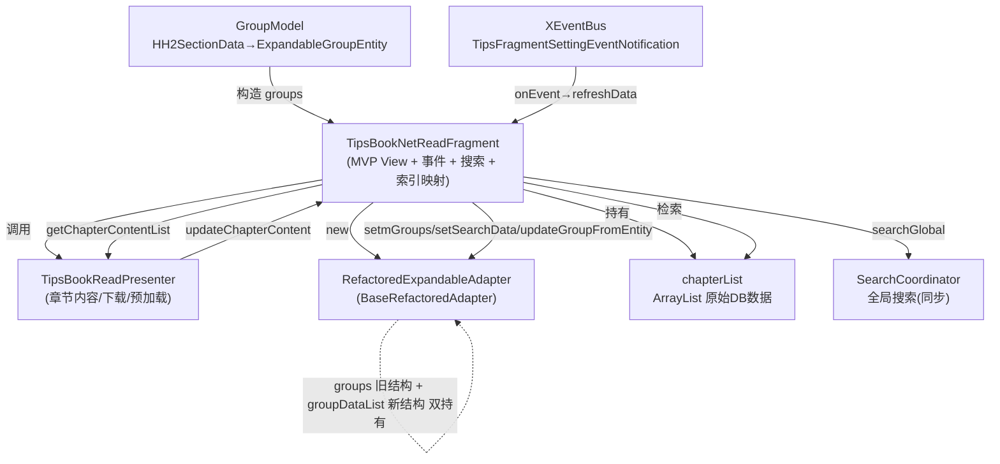

# TipsBookNetReadFragment 与适配器设计分析

> 分析对象：`ui/reader/bookread/TipsBookNetReadFragment.java`（979 行）
> 适配器：`ui/reader/adapter/RefactoredExpandableAdapter.java` + `BaseRefactoredAdapter.java`
> 目的：评估类与适配器设计是否合理、列出可证实的缺陷、给出优化方案。本文档为**迭代稿**：已先清理死代码并修复 D1，缺陷清单随核查持续更正（错误结论会就地订正并标注）。

---

## 1. 当前架构速写



**要点**：Fragment 既是 MVP 的 View，又兼任"索引映射器 / 搜索执行器 / EventBus 订阅者 / 内存裁剪者"。
Adapter 内部同时持有 `groups`（旧 `ExpandableGroupEntity`）和 `groupDataList`（新 `GroupData`）两套数据源，需手动保持同步。

---

## 2. 适配器设计评估

### 2.1 做得好的部分

- **状态外置**：`ExpandStateManager` 单独管理展开态，避免散落状态位。
- **绑定分层**：`BinderFactory` / `ViewHolderFactory` / `ReadMode*Handler` 拆分了"数据→视图"与"事件委托"，比原生的 `onBindXXX` 全堆在一起清晰。
- **公共能力上提**：`BaseRefactoredAdapter` 收敛了展开/收起、空指针保护、公共布局，子类只关心差异。
- **暴露的刷新粒度合理**：`notifyGroupChanged` / `notifyChildrenInserted` 等细粒度通知接口存在。

### 2.2 系统性缺陷（根因：双数据源 + 兼容层只维护了一半）

适配器处于"半重构"状态：干净的新模型（`GroupData`/`ItemData`）与遗留兼容层（`ExpandableGroupEntity groups`）共存，但**只有部分写入路径同步两者**，导致索引/数据随时可能错位。

| 写入入口 | 是否同步 `groups` | 是否同步 `groupDataList` | 备注 |
|---|---|---|---|
| `setmGroups / setGroups` | ✅ | ✅（转换） | 旧路径 |
| `setGroupDataList` | ❌ | ✅ | 新路径 |
| `setSearchData` | ❌ | ✅ | **搜索路径，groups 不更新** |
| `updateGroupData` | ❌ | ✅ | 新路径 |
| `updateGroupFromEntity` | ✅（若非 null） | ✅ | 新路径（但依赖 groups 非 null） |

结论：5 个入口里 3 个会令 `groups` 与 `groupDataList` 失同步。Fragment 又同时依赖这两个字段（`setHeaderClickListener` 读 `getmGroups()`、`updateChapterContent` 同时读写两者），是后续所有索引类 bug 的根源。

---

## 2.3 本轮已落地：死代码清理 + D1 修复（2026-10-07）

> 用户要求"先处理掉死代码、不使用的函数、注释，再分析缺陷、给方案"，故先执行一轮最小清理，并持续更正本文档。

**删除的死代码 / 空桩**

| 位置 | 内容 | 原因 |
|---|---|---|
| `RefactoredExpandableAdapter` | `setSearch(boolean)` / `getSearch()` 两个空桩 | 阅读模式下是 no-op，Fragment 的 5 处调用全无意义；且 `getSearch()` 恒 `false` 正是 D1 根因 |
| `TipsBookNetReadFragment` | `initView`/`initData`/`onClick` 中 5 处 `adapter.setSearch(...)` 调用 | 调用空桩，删后行为不变 |
| `TipsBookNetReadFragment.onTrimMemory` | `TRIM_MEMORY_RUNNING_CRITICAL` 的空 `if (adapter != null) { /* 可加清理 */ }` 分支 | 误导性空分支，无任何实现 |
| `GroupModel.getExpandableGroups` | 注释掉的 `// String EMPTY_STRING = ""` | 死注释 |
| `TipsBookNetReadFragment` | 4 处空 `/**  */` Javadoc 块 | 无意义占位注释 |

**D1 修复（与死代码清理同批）**
- 长按守卫 `if (adapter.getSearch()) return true;` → `if (isSearchActive()) return true;`，新增私有 `isSearchActive()` = `searchText != null && !searchText.isEmpty()`，与 `onHeaderClick` 的搜索态判定同源。
- 搜索态现在只有 `searchText` 一个真相，消除"适配器空桩 + Fragment 字段"双轨。
- 编译校验：`:app:compileDebugJavaWithJavac` BUILD SUCCESSFUL。

**已识别但未删（待统一路径阶段处理）**
- `RefactoredExpandableAdapter.updateGroupData(int, GroupData)`、`setGroupDataList(List<GroupData>)`：全仓无调用方，属"新结构"API 但暂未接线。文档 §2.2 已把它们列为新路径入口，故本轮**保留**，待数据源统一时一并接线或删除。
- `SearchStateManager`：见 D5（共享类，被 `RefactoredSearchAdapter` 使用，不能删）。

---

## 3. 缺陷清单（带证据）

### P0 — 正确性 bug

**D1. 搜索态判断走死桩，长按"重新下载"在搜索模式下索引错乱 —— ✅ 已修复**
- 原证据：`RefactoredExpandableAdapter.setSearch/getSearch` 是空桩（`getSearch()` 恒返回 `false`），`TipsBookNetReadFragment` 用 `if (adapter.getSearch()) return true;` 作长按守卫 → 守卫永远不触发；在搜索结果上长按"重新下本章节"会用**过滤后的 groupPosition** 直接下标 `chapterList`（越界或命中错误章节）。
- **修复（本轮已落地，见 §2.3）**：删除适配器死桩 `setSearch/getSearch` 及其 5 处 Fragment 调用；长按守卫改为 `if (isSearchActive()) return true;`，`isSearchActive()` = `searchText != null && !searchText.isEmpty()`，与 `onHeaderClick` 的搜索态判定同源。搜索态现在只由 Fragment 的 `searchText` 单一真相维护。
- 注：`reloadChapter` 仍用 `groupPosition` 直标 `chapterList`，但搜索态下已被守卫拦截不再触发；非搜索态 `groupPosition` 即真实索引，逻辑正确。

**D2. `setSearchData` 之后 `groups` 与 `groupDataList` 分离，下载完成回调会污染搜索结果**
- 证据：`RefactoredExpandableAdapter.setSearchData`（:69-109）只写 `groupDataList`，`groups`（旧结构）保持原章节列表不动。
- 之后若 `updateChapterContent`（:502-533）被触发（某章下载完成），它读 `adapter.getmGroups()`（仍是旧章节）构造 entity，再 `updateGroupFromEntity(groupPosition, ...)` 写回 `groupDataList` 的**同一 position**——而此时 `groupDataList` 是搜索结果。**索引对不上 → 渲染错位 / 数据被覆盖**。
- 这是潜伏型数据损坏，只在"先搜索、再有别章下载回调"时暴露，难以复现。

### P1 — 设计/一致性

**D3. 两套搜索代码路径并存且互相矛盾**
- 路径 A（Fragment 侧，同步）：`performGlobalSearch`（:731）→ `searchCoordinator.searchGlobal(keyword)` 直接拿结果 → `adapter.setSearchData(...)`。
- 路径 B（MVP 侧，异步）：Contract `showSearchResults`（:792）→ `adapter.setmGroups(...)`（旧路径）。
- Fragment 实际只走 A；`presenter.search()` 与 `showSearchResults` 是否为死代码需确认（见 D6）。
- 两条路分别走"新结构"和"旧结构"，正是 D2 错位的直接来源。

**D4. Fragment 持有 `chapterList`，又读 `adapter.getmGroups()`，索引语义在搜索/非搜索间漂移**
- `findChapterIndexByTitle`（:455）用 `chapterList` 按标题 O(n) 字符串匹配回映射真实索引；`setHeaderClickListener`（:315-338）在搜索态才做此映射，非搜索态直接用 `groupPosition`。
- 风险：标题重复 → 映射错章；搜索/非搜索切换时 `currentIndex` 语义不一致（:341-342 仅在 `isShowBookCollect` 时记录）。

**D5. 适配器内 `SearchStateManager` 未真正使用（已厘清范围）**
- `BaseRefactoredAdapter` 构造了 `searchStateManager`（:61，构造于 :92），`cleanup()` 里只 `reset()` 一次（:446），`RefactoredExpandableAdapter` 全程从未调用其 `enterSearchMode/isSearchMode` 等方法。
- **更正**：它并非全局死代码——`RefactoredSearchAdapter`（书内搜索页）在 :52/:77 调用 `enterSearchMode(keyword)` 真正记录搜索态。因此**不能从基类删除**；本适配器只是没用它。结论：搜索态在"阅读页"这条路径上确实从未落地（与 D1 死桩互为佐证），但治理方式应是"阅读页自己维护 `searchText` 单一真相"（已随 D1 修复落地），而非删除共享管理器。

### P2 — 生命周期/资源

**D6. 双搜索路径与未接线（部分已厘清/已修）**
- `TipsBookReadContract` 声明 `showSearchResults`（:46）与 `search(String)`（:201）。经核查 Presenter 有**两个** `search()`：`TipsBookReadPresenter:530`（有效，内部调 `view.showSearchResults`）与 `:627`（已显式标注"已弃用，使用 SearchCoordinator"）。**阅读页 `TipsBookNetReadFragment` 从未调用 `presenter.search()`**，而是直接走 `performGlobalSearch` → `SearchCoordinator` → `adapter.setSearchData`（路径 A）。因此 `showSearchResults`（Fragment :792）与那条 MVP 搜索链在该屏是**事实上的死路径**（仅 `showChapterList` :759 被正常调用）。建议：要么让阅读页改走 `presenter.search()` 统一入口，要么删掉 `showSearchResults`/弃用 `search()` 以消歧义。本轮先保留，待统一搜索路径阶段处理。
- `onTrimMemory` 的 `TRIM_MEMORY_RUNNING_CRITICAL` 空分支（原 :904-909）**已删除**（本轮），消除误导性空 `if`。
- `bridgeAddToBookshelf` / `showAddToBookshelfConfirmDialog`：**纠正原文怀疑**——二者均为活代码：Presenter :665 调 `view.showAddToBookshelfConfirmDialog` → Fragment :935 → :944 `bridgeAddToBookshelf`。并非死代码，原文 D6 的"疑似未被调用"判断错误，已更正。

**D7. XEventBus 注册/注销不对称，存在重入与竞态**
- 注册在 `initView()`（:193），注销只在 `onDestroy()`（:644）。`onDestroyView` 未注销。
- 若 view 重建而 Fragment 实例存活（配置变更），handler 仍挂在上一轮 → 事件触发 `refreshData()` 操作已销毁的 view 成员（虽有多重 null 守卫，但属脆弱防护）。
- `onEvent`（:270）每次都 `refreshData()` → `bookInitData()` 异步重新从 DB 拉 `chapterList`；连发事件会**并发多趟异步加载，`chapterList` 被最后完成者覆盖**，无取消机制。

**D8. `searchCoordinator` 未在销毁时清理**
- `initData`（:232）`new SearchCoordinator(bookId)`，但 `onDestroy`/`onDestroyView` 均未 `cancel`/`null` 它。若其内部持回调或线程，会随 Fragment 泄漏。

**D9. `getExpandableGroups` 每次重建整份实体列表**
- `reListAdapter`（:684）与 `updateChapterContent`（:514）各自从 `HH2SectionData` 重新 `GroupModel.getExpandableGroups / getExpandableGroupEntity` 构造实体。未增量更新，章节多时有不必要开销（属优化项，非 bug）。

---

## 4. 优化方案（目标架构）

### 4.1 根因治理：让适配器只持有一份数据源

**原则**：废弃 `groups` 旧兼容层，适配器以 `groupDataList`（`GroupData`）为唯一真相；`ExpandableGroupEntity` 仅在"需要从旧模型构造"的边界一次性转换为 `GroupData`，之后不再回写。

```java
// BaseRefactoredAdapter 改动示意
protected final List<GroupData> groupDataList;          // 唯一数据源
// 删除 protected ArrayList<ExpandableGroupEntity> groups;
// 删除 getmGroups()/setmGroups()（旧兼容层）
// 统一入口：
public void submitList(@NonNull List<GroupData> list) { /* 替换 + reset 展开态 + notify */ }
```

Fragment 侧相应改为只操作 `GroupData`：
- `reListAdapter` → `adapter.submitList(GroupModel.toGroupData(contentList, isExpand))`
- `updateChapterContent` → 直接对 `groupDataList.get(pos)` 做字段更新（保留展开态），不再经 `ExpandableGroupEntity` 中转。
- 搜索：`setSearchData` 与 `submitList` 走同一 setter，消除 D2 的分离。

### 4.2 修复搜索态（D1 ✅已落地 / D5 范围已厘清）

D1 已在本轮落地（§2.3）：不引入新字段，而是用 `isSearchActive()`（`searchText != null && !searchText.isEmpty()`）作为搜索态唯一真相，`onHeaderClick`/`onHeaderLongClick` 全部走它，删除了适配器的空桩 `setSearch/getSearch`。

D5 更正：阅读页不需要 `SearchStateManager`（它属于 `RefactoredSearchAdapter` 的搜索页路径，见 D5）。阅读页的搜索态治理 = `isSearchActive()` 即可，不要试图在适配器里落地搜索态。

### 4.3 统一搜索路径（D3/D6）

二选一，建议**让 Fragment 走 Presenter**：
- 删除 Fragment 的 `performGlobalSearch` 同步直调，改为 `presenter.search(keyword)`；
- Presenter 调 `SearchCoordinator` 后回调 `view.showSearchResults(results, count)`；
- `showSearchResults` 内部用 4.1 的统一 `submitList`（新结构），与正常列表同构。
- 确认 `setSearchData` 调用点仅此一处后删除之。

### 4.4 索引单一真相（D4）

- 让 `HH2SectionData`/构造出的 `GroupData` 携带稳定 `chapterIndex`（或章节 id），UI 点击/长按直接使用该字段，**彻底去掉 `findChapterIndexByTitle` 的标题字符串匹配**。
- `chapterList`（原始 DB 实体）与 `groupDataList` 的对应由"构造时就绑定 index"保证，而非运行时回查。

### 4.5 生命周期与竞态（D7/D8）

- EventBus 改为 `onStart` 注册 / `onStop` 注销（或在 `initView` 注册、`onDestroyView` 注销），与 view 生命周期对齐。
- `refreshData` 的异步加载加"在途标记/取消"：新一次加载发起时取消/忽略上一趟（`DbService.readInBackground` 的 `Callback` 加 token 校验）。
- `onDestroyView` 中 `searchCoordinator.cancel()` 并置 null。

### 4.6 清理（D6/D9）

- 删除 `onTrimMemory` 空分支，或实现真正的轻量回收（如清空 `spannableStringCache`）。
- `getExpandableGroups` 仅在数据变更时重建，子项内容更新走增量 `updateGroupData(pos, ...)`，避免整表重排。

---

## 5. 落地优先级与风险

| 阶段 | 内容 | 风险 | 门禁 |
|---|---|---|---|
| 1 | D1 搜索态守卫修复（✅ 已落地，见 §2.3）；D5 范围厘清：阅读页用 `isSearchActive()` 不碰 `SearchStateManager` | 低 | 装机能复现"搜索结果长按"无越界提示 |
| 2 | D4 索引绑定 chapterIndex | 中，需确认 `HH2SectionData` 已有或可加 index 字段 | 搜索/非搜索点击、长按都命中正确章 |
| 3 | D2+D3 统一数据源与搜索路径 | 高，跨 `TipsBookNetReadFragment` 与 `BookContentSearchActivity` 两消费者 | 两页面列表/搜索/展开全部回归 |
| 4 | D7+D8 生命周期与竞态 | 中，需回归配置变更 | logcat 无重复加载、无泄漏 |
| 5 | D6+D9 清理 | 低 | 全量单测 + 装机 |

**爆炸半径提醒**：`RefactoredExpandableAdapter` 被 `TipsBookNetReadFragment` 与 `BookContentSearchActivity` 共用；阶段 3 改动适配器公开 API 时，两处必须同步适配，建议同轮完成并一起回归。

---

## 6. 结论（ADR 立场摘要）

当前适配器"骨架良好、填充半残"：**分层与状态管理方向正确，但遗留的 `groups` 双数据源兼容层未被完整维护，是 P0 索引 bug 的唯一根因**。优先做 4.1（单一数据源）+ 4.2（真实搜索态）可消除最严重缺陷；4.3/4.4 是消除"两套搜索路径 + 标题回查"的彻底解，但波及两个消费者，需阶段化推进。在阶段 3 落地前，建议先以 4.2 的最小改动为搜索态守卫止血。

（如认可上述方向，下一步可将其拆为正式 ADR-0002 + 术语表 glossary，并进入代码实施。）
